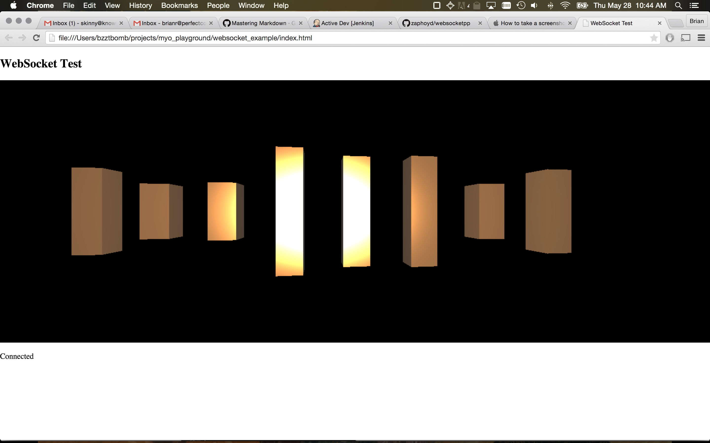
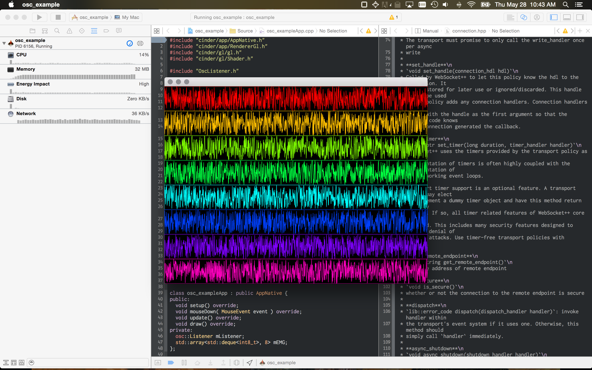

armBAND

A project for DorkbotPDX May 2015 OpenLab:  http://dorkbotpdx.org/openlab_05_2015

I'm hoping to get two or three people to build things that react to this Myo Armband I got.  In order to make that happen, I've built a server that spits out the muscle data (EMG) from the armband.  The data is sent via OSC (direct or broadcast udp) and is published via WebSockets.

I've written two example apps that react to the data streams to give people a starting point.

Projects:

#myo_server:

No one will have to compile this for the workshop, it will just run on the machine that the Myo Armband is connected to.  It is currently an XCode project that creates a command-line server that pushes out the myo data over OSC/WebSockets.  It doesn't rely on any OSX libraries and should be portable to other OS's with some build system love.

##Dependencies:

* Make sure to do a submodule update to get myo_server/lib/websocketpp.
* Download the myo sdk into lib/myo_sdk (not included because I wasn't sure I could)
* Install boost somewhere and update the BOOST_DIR variable in Xcode to point at it (not included because it is huge)

After that is done, you should be able to build it.

#websocket_example:

This is a quick [three.js](http://threejs.org) example that uses websockets to get the myo data.  It only requires a running myo_server and a web browser that supports WebGL 1.

#osc_example:

This is a quick [Cinder](http://libcinder.org) sketch that consumes the OSC packets and generates a graph for each sensor reading.

##Dependencies:

Get Cinder from github, checkout the latest glNext branch.
Update the CINDER_PATH variable in the XCode project to point at your Cinder install.

